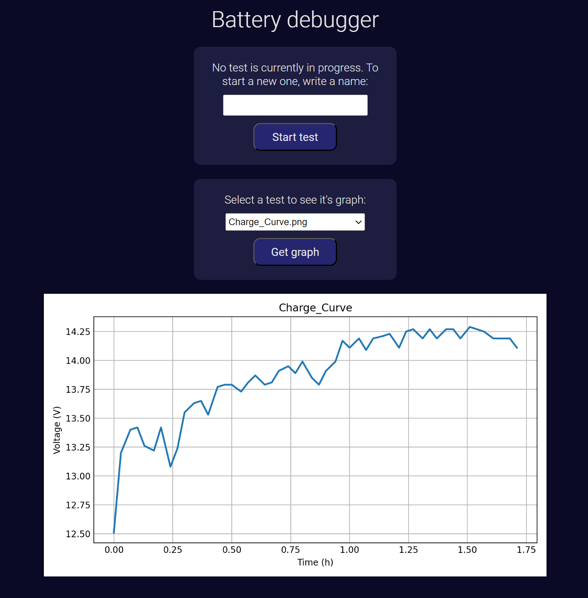
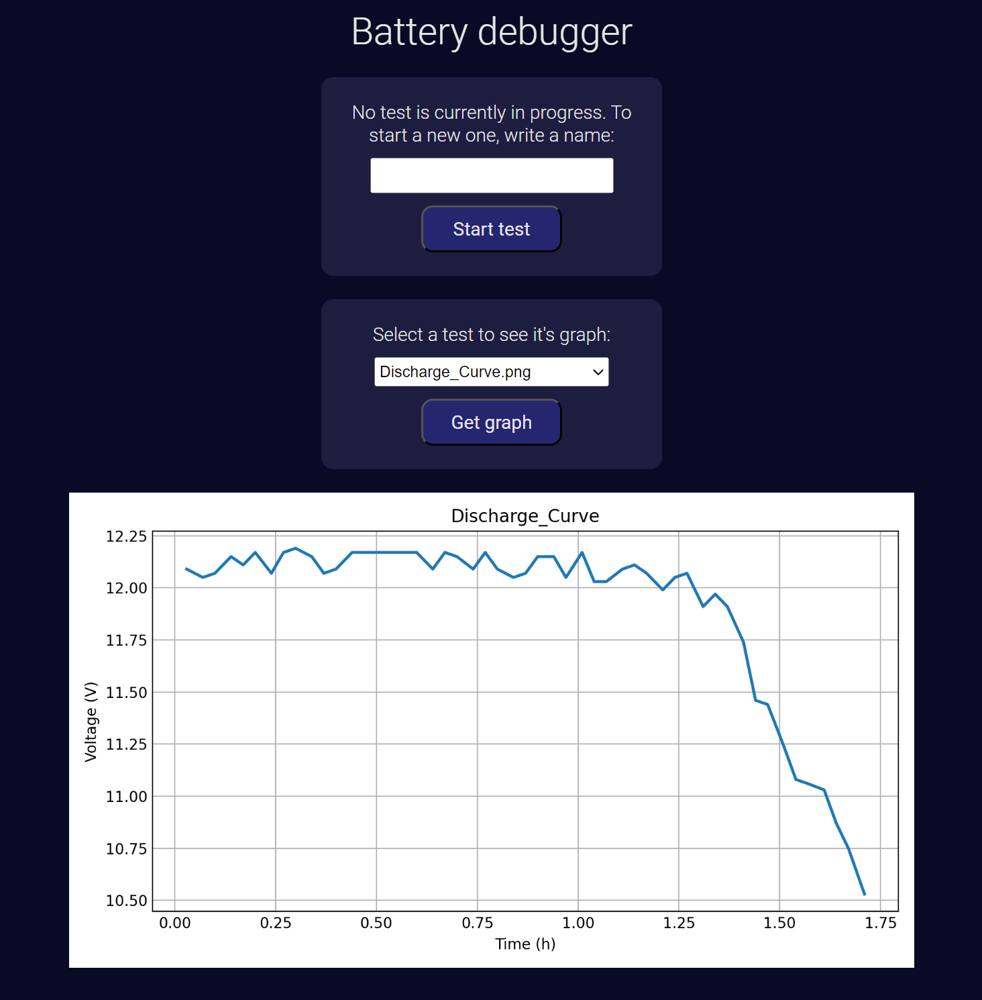

# battery-debugger

### Objective:
Have a way to track the health state of batteries, based on periodically measure the charge and discharge curves under constant test conditions. Specifically, this project aims to know the degradation grade of a Lead Acid battery which is working along a solar panel installation. Taking the curves periodically (maybe annualy, or semi-annually), a simple comparisson between them will show the capacity loss. The test conditions to measure the curves should always be the same to ensure comparability (e.g. same circuit load for discharge, same weather and sun position for charge, etc.). Besides that specific objective, this project could also be useful to test batteries of other types and other appliances.

### Developed solution:
- During the test, an **ESP8266** based board takes periodic readings of the battery voltage through it's analog input, and sends the values to a backend.
- A **NodeJS** backend takes those readings, and saves them in a **CSV** file.
- When the test is complete, the **NodeJS** backend starts a **Python** script that plots the readings as a graph in a **PNG** image, using **matplotlib**.
- Finally, a static webpage served with **http-server** allows the user to see the graphs. That webpage also has interactive menus to start and stops tests fron there.

Those projects, are in the `backend`, `frontend` and `firmware` directories.  
The graphs images are saved in the `records` directory.

### Usage:
The procedure to measure a discharge curve should be:
1. Disconnect the solar panel or wait until night (to ensure that the battery is not charging)
2. Connect a fixed load to the battery output
3. Connect the **ESP**
4. Navigate to the webpage and start a new test (to tell the backend to save the readings in a new file)
5. Wait until the battery is depleted
6. Disconnect the load and the **ESP**
7. Navigate to the webpage and stop the test (to tell the backend to stop saving readings in that file and generate a **PNG**)
8. Navigate to the webpage and see the graph

The procedure to measure a charge curve should be:
1. Completely discharge the battery (to ensure an empty state at the starting point of the curve)
2. Check the weather conditions and sun position (to replicate the future tests under similar conditions)
4. Connect the **ESP**
4. Navigate to the webpage and start a new test (to tell the backend to save the readings in a new file)
6. Wait until the battery is full
7. Disconnect the **ESP**
8. Navigate to the webpage and stop the test (to tell the backend to stop saving readings in that file and generate a **PNG**)
9. Navigate to the webpage and see the graph

### Examples:
Some examples of real battery tests, viewed on the webpage.  

#### Charge curve example:  

  

#### Discharge curve example:  

