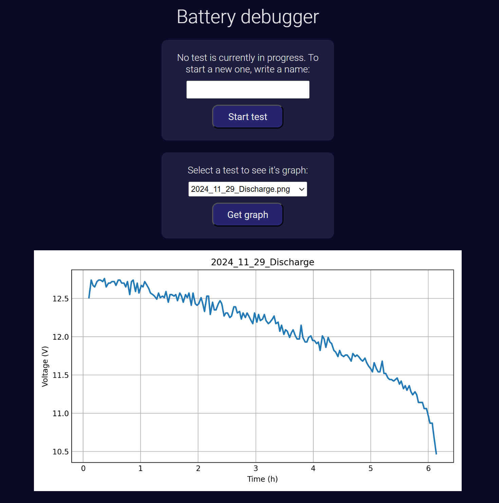

# Frontend
This plain **HTML**, **JS** and **CSS** frontend allows the end-user to manage and the the current and past tests, and it's served using the **http-server** package.  

With it, the user can:
- Start a new test, defining it's name
- Stop the test that is currently in progress
- See any saved test graph

### Development notes:
A `env.js` file is required to define the URL where the backend and the frontend are served. Copy the `env.js.example`, rename it, and replace the variable with the corresponding value.  

To serve the frontend, use:  
`npm start`

To serve the frontend as a background process (useful to free the terminal on a remote server), use:  
`pm2 start "npm start"`

### Examples:
Some examples of the frontend menus.

#### No test in progress:  

  

#### Test in progress:  

  

#### Seeing a test graph:  

